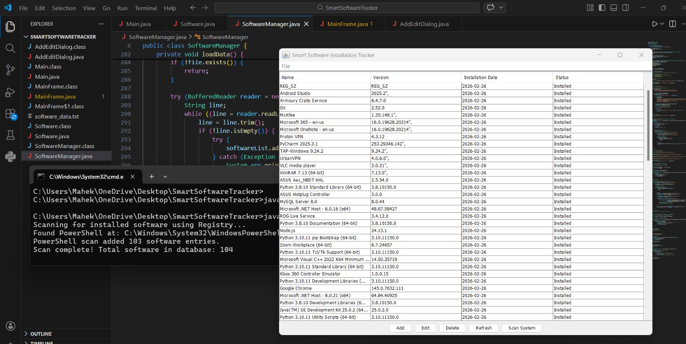
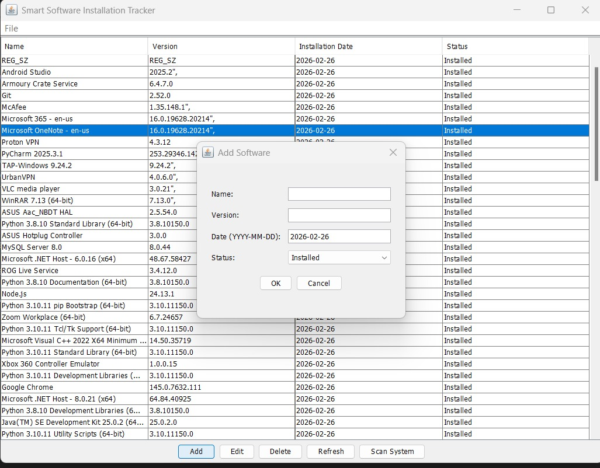
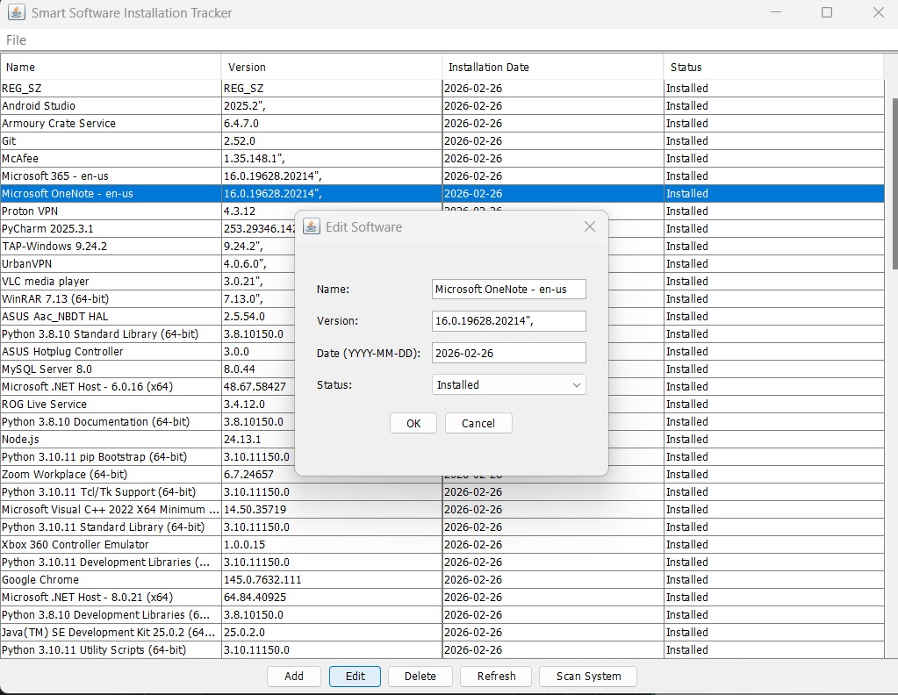

# 💻 Smart Software Installation Tracker

A Windows desktop application built using **Java (Swing + JDBC)** that scans installed software, stores records, and provides a dashboard to manage software installation data.

---

## 🚀 Features
- Scan installed software from Windows Registry (PowerShell)
- View software name, version, installation date, and status
- Add / Edit / Delete software records
- Real-time system scan
- JTable-based GUI dashboard
- Database / file storage support

---

## 🛠️ Technologies
Java, Swing, JDBC, MySQL, OOP, PowerShell

---

#### 🖼️ Installation List

#### 🖼️ Add Software Dialog

#### 🖼️ Main Dashboard

---

## ▶️ How to Run
1. Clone repository  
2. Open in VS Code / IntelliJ / Eclipse  
3. Run `Main.java`

---

## 🎯 Learning Outcomes
OOP, JDBC connectivity, Prepared Statements, Batch Processing, Scrollable ResultSets, Desktop GUI development.

---

## 👩‍💻 Developed By
Mahek Shikalgar

⭐ Star the repo if you like this project!
